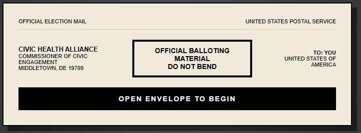
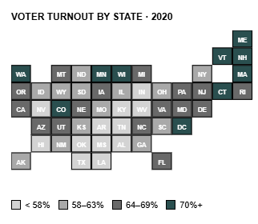
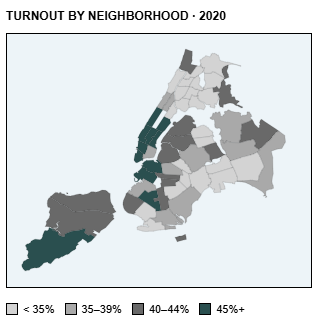
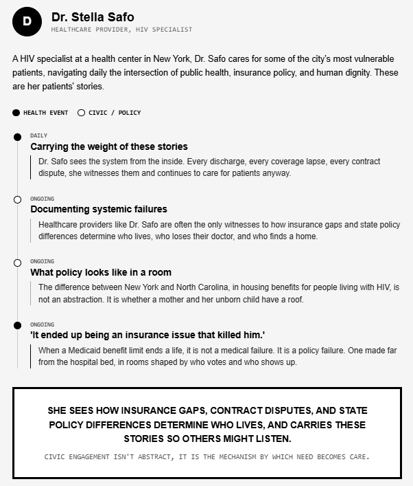

# 🗳️ Civic Health Alliance: Official Health Ballot


*(Replace with a screenshot of the main envelope or intro screen)*

An interactive, ballot-style web experience exploring the critical intersection of civic participation and healthcare outcomes in the United States. 

This project visualizes how voter turnout correlates with life expectancy and uninsured rates, taking the user on a journey from national state-level trends down to local New York City neighborhoods, and finally grounding the data in real human stories.

## 📖 About the Project

*“Civic engagement isn't abstract. It is the mechanism by which need becomes law, and law becomes care, and care becomes survival.”*

This visual investigation demonstrates that states and neighborhoods where residents vote more frequently tend to have lower uninsured rates and higher life expectancies. The experience is designed to mimic an official election ballot to emphasize that health policy is shaped directly at the ballot box.

## ✨ Key Features & Walkthrough

### 1. The National Picture (US Map)


* Interactive tile map of the United States.
* Displays 2020 voter turnout, uninsured rates, and life expectancy for each state.
* Highlights the correlation between high civic engagement and stronger health metrics.

### 2. The Local Picture (NYC Map)

*(Replace with a screenshot of the NYC Neighborhood Map)*

* Brings the national data down to a granular, local level using New York City neighborhoods.
* Shows the stark life expectancy gaps (e.g., the 12-year gap between adjacent neighborhoods) and how they map to local voter turnout.

### 3. Legislative Measures (Patient Stories)

*(Replace with a screenshot of an expanded patient story on the Legislative side)*

* Grounds the statistical data in real human experiences.
* Features interactive patient records documenting how civic failures (like Medicaid benefit limits or state-level housing policies) result in direct, often fatal, health outcomes.

## 📊 Data Sources

The data driving this visualization is sourced from official public health and electoral databases:

**National Data:**
* **Voter Turnout:** [UF Election Lab](https://election.lab.ufl.edu/voter-turnout/2020-general-election-turnout/), 2020 Voting-Eligible Population (VEP)
* **Uninsured Rates:** [Kaiser Family Foundation (KFF)](https://www.kff.org/state-health-policy-data/state-indicator/total-population/?currentTimeframe=0&sortModel=%7B%22colId%22:%22Location%22,%22sort%22:%22asc%22%7D) ACS estimates, 2022-2023
* **Life Expectancy:** [CDC National Vital Statistics Reports](https://www.cdc.gov/nchs/data/nvsr/nvsr74/nvsr74-12.pdf), Vol. 74 No. 12, 2022

**New York City Data:**
* **Voter Turnout:** [NYC Campaign Finance Board (CFB) Community Profiles](https://www.nyccfb.info/nyc-votes/community-profiles/), 2020
* **Life Expectancy:** [NYC DOHMH Community Health Profiles](https://a816-health.nyc.gov/hdi/profiles/), 2021 (2010-2019 average)

## 🛠️ Technologies Used

* **HTML5** (Semantic structure)
* **CSS3** (Custom properties, grid/flexbox layouts, CSS animations, 3D transforms for ballot flipping)
* **Vanilla JavaScript** (DOM manipulation, state management, SVG generation)
* **SVG** (Scalable Vector Graphics for the tile maps)

## 🚀 Running the Project Locally

Because this project is built entirely with plain HTML, CSS, and JavaScript without external build tools or frameworks, running it is incredibly simple:

1. Clone the repository:
   ```bash
   git clone [https://github.com/yourusername/civic-health-ballot.git](https://github.com/yourusername/civic-health-ballot.git)